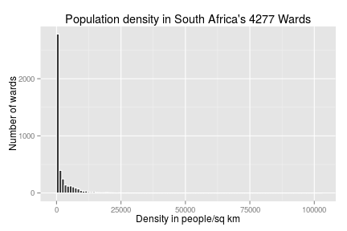

Chorpleth overlay
===
Mean population density in South Africa in people per km^2 is:


```
[1] 42.4
```
The distribution of Population density is very skewed
 

===
What the satellite images look like without a choropleth overlay


===
What the choropleth overlay looks like with the Threshold at the 50th percentile of Ward Population Density


===
What the choropleth overlay looks like with the Threshold at 70th percentile of Ward Population Density


====
What the choropleth overlay looks like with the Threshold at 95th percentile of Ward Population Density

